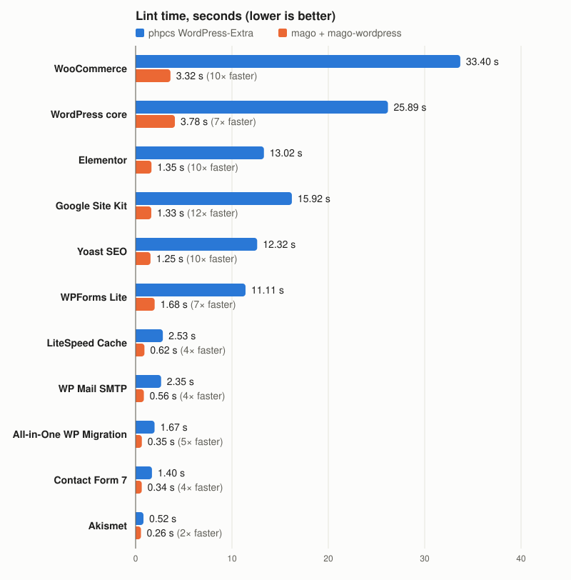

# mago-wordpress

[](https://github.com/rlorenzo/mago-wordpress/actions/workflows/ci.yml)
[](https://packagist.org/packages/rlorenzo/mago-wordpress)
[](https://packagist.org/packages/rlorenzo/mago-wordpress)
[](composer.json)
[](https://github.com/carthage-software/mago)
[](LICENSE)

WordPress Coding Standards for [Mago](https://github.com/carthage-software/mago), as a Mago extension.
It ports the WPCS lint sniffs (the `WordPress.*` rules phpcs runs) to Mago's linter, so a WordPress
plugin or theme is checked in seconds instead of minutes.

Formatting sniffs (whitespace, alignment, braces) are not ported: that is `mago format`'s job, and
the shipped config sets it as close to WordPress style as it goes (see [Formatting](#formatting)).

## 2–11× faster than phpcs

<picture>
  <source media="(prefers-color-scheme: dark)" srcset="docs/benchmarks-dark.svg">
  
</picture>

Same machine, same code, mean of three runs, on the top 10 WordPress.org plugins by active installs plus WordPress core itself; details and the reproducible script are in [Benchmarks](#benchmarks).

## Install

```shell
composer require --dev carthage-software/mago rlorenzo/mago-wordpress
```

Then extend the shipped configuration from your `mago.toml`:

```toml
extends = "vendor/rlorenzo/mago-wordpress/wordpress.mago.toml"
```

That starts the extension worker and enables Mago's own `wordpress` integration: eight core
WordPress rules (see [Mago's own WordPress rules](#magos-own-wordpress-rules) below) plus this
package's rules. Run `mago lint` as usual.

### Security

The extension worker runs as PHP inside your project and loads your Composer autoloader,
including any `autoload.files` your project or its dependencies declare — the same trust model
as PHPUnit, PHPStan or any other Composer-installed dev tool. Only lint projects you trust.

## Configuration

Mago does not pass custom options to extension rules, so this package reads the settings WPCS
takes as sniff properties from your project instead. Put them in `composer.json`:

```json
{
  "extra": {
    "mago-wordpress": {
      "text-domains": ["my-plugin"],
      "prefixes": ["myplugin", "mp_"],
      "minimum-wp-version": "6.4",
      "custom-escaping-functions": ["mp_esc"],
      "custom-auto-escaped-functions": [],
      "custom-sanitizing-functions": [],
      "custom-unslashing-sanitizing-functions": [],
      "custom-capabilities": [],
      "allowed-custom-properties": [],
      "max-posts-per-page": 100,
      "min-cron-interval": 900,
      "additional-word-delimiters": "",
      "honor-phpcs-comments": true,
      "exclude-patterns": {
        "WordPress.Files.FileName": ["/tests/*"],
        "WordPress.PHP.YodaConditions": ["*"]
      }
    }
  }
}
```

Defaults mirror WPCS 3.4.1 out of the box: `minimum-wp-version` is `6.7` (deprecations newer
than that are reported with a note, where WPCS lowers them to a warning), and rules for PHP features removed before PHP 8.1
are limited to the ones `WordPress-Core` itself runs. The extension targets PHP 8.1+ and the
WordPress versions that support it.

If there is no `extra.mago-wordpress` block, the worker reads the same values from your existing
`phpcs.xml` (`text_domain`, `prefixes`, `minimum_wp_version`, `customEscapingFunctions`,
`posts_per_page`, `min_interval`, `additionalWordDelimiters`, `allowed_custom_properties`, ...) and the
codes it turns off (see `exclude-patterns` below), so a project migrating from phpcs needs no new configuration. An explicitly present but empty `extra.mago-wordpress` block
(`{"extra": {"mago-wordpress": {}}}`) means "use the defaults" and does not fall back to `phpcs.xml`.

Properties are read only when set directly on the sniff's own `<rule ref="WordPress.WP.I18n">` (and
similar); a `<rule ref="WordPress-Extra">` or other ruleset that merely *includes* that sniff is not
followed, so set properties on the sniff ref itself, as phpcs recommends.

`custom-capabilities` lists capabilities `wordpress/capabilities` accepts. The other four `custom-*`
lists (`custom-escaping-functions`, `custom-auto-escaped-functions`, `custom-sanitizing-functions`,
`custom-unslashing-sanitizing-functions`) are parsed and stored but currently have no effect: no rule
in this package reads them yet. They mirror WPCS properties used by Mago's core rules `no-unescaped-output`,
`nonce-verification` and `validated-sanitized-input` (see
[Mago's own WordPress rules](#magos-own-wordpress-rules)), which cannot receive per-project options
from an extension. They are reserved for a planned port of those rules into this package.

The rules honour the phpcs suppression comments already in your code, as PHP_CodeSniffer does:
`phpcs:ignore` (on its own line it silences the next line, trailing code it silences its own line),
`phpcs:disable` / `phpcs:enable` regions, `phpcs:ignoreFile`, and the legacy
`@codingStandardsIgnoreLine`, `@codingStandardsIgnoreStart` / `@codingStandardsIgnoreEnd` and
`@codingStandardsIgnoreFile`. A code list matches the WPCS code a rule ports at any level:
`WordPress`, `WordPress.Security`, `WordPress.Security.SafeRedirect` or a message code such as
`WordPress.WP.I18n.MissingTranslatorsComment`. Set `"honor-phpcs-comments": false` to report
everything regardless. There is no `phpcs.xml` equivalent.

`allowed-custom-properties` lists mixed-case object properties `wordpress/valid-variable-name`
accepts (WPCS's `allowed_custom_properties`), such as `childNodes` for `DOMDocument`.

Mago (as of 1.50) rejects extension rule codes under `[linter.rules]` in `mago.toml` (`unknown field
"wordpress/..."`), so this package's rules are turned off with `exclude-patterns` instead: WPCS code
(standard, category, sniff or message code) mapped to phpcs `<exclude-pattern>` values, with phpcs's
semantics (a regex in which `*` means `.*`, matched case-insensitively anywhere in the path). `"*"`
turns the code off everywhere. So `"WordPress.WP.I18n.MissingTranslatorsComment": ["/tests/*"]`
silences one message under `tests/` and leaves the rest of `wordpress/wp-i18n` alone. Without an
`extra.mago-wordpress` block the same exclusions are read from `phpcs.xml`: the sniffs its
`WordPress-Core` or `WordPress-Extra` ref leaves out, `<exclude name>`, a `<severity>` below 5, and
`<exclude-pattern>` inside a `<rule ref>`. Levels of extension rules cannot be changed. Mago's own
core rules are configured in `mago.toml` as usual.

## Rules

| Rule | Ports | Checks |
|:---|:---|:---|
| `wordpress/assignment-in-ternary-condition` | `WordPress.CodeAnalysis.AssignmentInTernaryCondition` | a variable, array element or property assignment inside a parenthesized ternary condition |
| `wordpress/capabilities` | `WordPress.WP.Capabilities` | roles, deprecated capabilities and unknown capabilities passed to `current_user_can()`, `add_menu_page()` and the other capability checks; accepts `custom-capabilities` |
| `wordpress/capital-p-dangit` | `WordPress.WP.CapitalPDangit` | "Wordpress"/"wordpress"/"word press" misspellings in strings, inline HTML, comments, class-like and namespace names (not in URLs, paths, arrays or constant declarations) |
| `wordpress/class-name-case` | `WordPress.WP.ClassNameCase` | a WordPress core, default-theme or bundled-library (getID3, PHPMailer, Requests, SimplePie, Avifinfo, AI Client) class referenced with the wrong case (instantiation, static call, class constant, `extends`, `implements`) |
| `wordpress/cron-interval` | `WordPress.WP.CronInterval` | `cron_schedules` intervals under `min-cron-interval` (default 900 seconds); closures, arrow functions, and callbacks naming a function or method declared in the same file (string, array, or first-class callable) are inspected, and an unresolvable callback or interval gets a `ChangeDetected` warning |
| `wordpress/db-restricted-classes` | `WordPress.DB.RestrictedClasses` | `mysqli`, `PDO` and `PDOStatement` usage |
| `wordpress/db-restricted-functions` | `WordPress.DB.RestrictedFunctions` | raw `mysql`/`mysqli`/`mysqlnd`/`maxdb` extension function calls |
| `wordpress/discouraged-constants` | `WordPress.WP.DiscouragedConstants` | usage and (re-)declaration of discouraged WordPress constants such as `STYLESHEETPATH` or `PLUGINDIR` |
| `wordpress/discouraged-wp-functions` | `WordPress.WP.DiscouragedFunctions`, `WordPress.PHP.DiscouragedPHPFunctions`, `WordPress.PHP.DevelopmentFunctions` | `query_posts()`, `wp_reset_query()`, serialization, obfuscation, system calls, debug output |
| `wordpress/dont-extract` | `WordPress.PHP.DontExtract` | `extract()` |
| `wordpress/enqueued-resource-parameters` | `WordPress.WP.EnqueuedResourceParameters` | missing, `null`, or falsy `$ver` and missing `$in_footer` on enqueue and register calls |
| `wordpress/enqueued-resources` | `WordPress.WP.EnqueuedResources` | hardcoded `<script src>` and `<link rel="stylesheet">` tags, in PHP strings or inline HTML |
| `wordpress/escaped-not-translated` | `WordPress.CodeAnalysis.EscapedNotTranslated` | `esc_html()`/`esc_attr()` called with more than one argument, which likely should be `esc_html__()`/`esc_attr__()` |
| `wordpress/file-name` | `WordPress.Files.FileName` | file names not lowercase and hyphenated, a class file missing its `class-` prefix, a templated `wp-includes` file missing its `-template` suffix |
| `wordpress/get-meta-single` | `WordPress.WP.GetMetaSingle` | `get_*meta()`/`get_metadata*()` calls that pass the key parameter without also passing `$single` |
| `wordpress/global-variables-override` | `WordPress.WP.GlobalVariablesOverride` | assignments, foreach bindings, destructuring and `$GLOBALS[...]` writes (including array-element writes) to WordPress's protected globals (243 names), skipping unit-test classes |
| `wordpress/plugin-menu-slug` | `WordPress.Security.PluginMenuSlug` | `__FILE__` passed as the slug or parent-slug argument of `add_menu_page()` and the other admin menu-registration functions |
| `wordpress/posts-per-page` | `WordPress.WP.PostsPerPage` | `posts_per_page`/`numberposts` over `max-posts-per-page` (default 100; `-1` and `nopaging` are not flagged, as in WPCS) in any array literal, `$args['key'] = ...`/`??=` assignment, or `posts_per_page=999`-style query string (it does not follow `$args` variables into `WP_Query`) |
| `wordpress/prefix-all-globals` | `WordPress.NamingConventions.PrefixAllGlobals` | unprefixed global functions, classes, constants and hook names; inert until `prefixes` is configured |
| `wordpress/prepared-sql-placeholders` | `WordPress.DB.PreparedSQLPlaceholders` | quoted, unsupported or unescaped placeholders, SQL wildcards in `LIKE` operands, dynamic `IN ()` lists and count mismatches in `$wpdb->prepare()` |
| `wordpress/prepared-sql-unquoted-complex-placeholder` | `WordPress.DB.PreparedSQLPlaceholders.UnquotedComplexPlaceholder` | unquoted complex placeholders (`%1$s`, `%05s`, `%'.10s`) in `$wpdb->prepare()` queries |
| `wordpress/restricted-php-functions` | `WordPress.PHP.RestrictedPHPFunctions` | `create_function()` |
| `wordpress/safe-redirect` | `WordPress.Security.SafeRedirect` | `wp_redirect()` instead of `wp_safe_redirect()` |
| `wordpress/slow-db-query` | `WordPress.DB.SlowDBQuery` | `meta_query`, `tax_query`, `meta_key`, `meta_value` as array-literal keys (it does not follow `$args` variables into `WP_Query`), `$args['meta_key'] = ...` assignments, and `'meta_key=...'` query strings |
| `wordpress/strict-in-array` | `WordPress.PHP.StrictInArray` | `in_array()`, `array_search()` and `array_keys()` called without `true` as the `$strict` argument |
| `wordpress/type-casts` | `WordPress.PHP.TypeCasts` | `(double)`/`(real)` normalized to `(float)`, `(unset)` forbidden, `(binary)` and binary string literals discouraged |
| `wordpress/valid-function-name` | `WordPress.NamingConventions.ValidFunctionName` | function and method names not in snake_case, and double-underscore names that are not PHP magic methods |
| `wordpress/valid-hook-name` | `WordPress.NamingConventions.ValidHookName` | hook names with uppercase letters or separators other than `_` and `additional-word-delimiters` |
| `wordpress/valid-post-type-slug` | `WordPress.NamingConventions.ValidPostTypeSlug` | invalid characters, reserved names, a reserved prefix, or a slug over 20 characters in `register_post_type()` |
| `wordpress/valid-variable-name` | `WordPress.NamingConventions.ValidVariableName` | variables, properties and object property accesses not in snake_case, including interpolated variables |
| `wordpress/wp-date-time` | `WordPress.DateTime.RestrictedFunctions`, `WordPress.DateTime.CurrentTimeTimestamp` | `date()`, `date_default_timezone_set()`, `current_time('timestamp')` |
| `wordpress/wp-deprecated-classes` | `WordPress.WP.DeprecatedClasses` | deprecated core classes; a deprecation newer than `minimum-wp-version` is reported with a note (WPCS lowers it to a warning) |
| `wordpress/wp-deprecated-functions` | `WordPress.WP.DeprecatedFunctions` | 386 deprecated core functions with their replacements; a deprecation newer than `minimum-wp-version` is reported with a note (WPCS lowers it to a warning) |
| `wordpress/wp-deprecated-parameter-values` | `WordPress.WP.DeprecatedParameterValues` | calls passing a deprecated value for a still-valid parameter (e.g. `bloginfo('home')`); newer than `minimum-wp-version` is reported with a note |
| `wordpress/wp-deprecated-parameters` | `WordPress.WP.DeprecatedParameters` | calls passing a non-default value for a now-ignored deprecated parameter; newer than `minimum-wp-version` is reported with a note |
| `wordpress/wp-i18n` | `WordPress.WP.I18n` | wrong, missing or empty text domains, missing or extra arguments, non-literal strings, placeholder-only or HTML-wrapped strings, placeholder mismatches in `_n()`, unordered placeholders, missing `translators:` comments, `_()` and the low-level `translate()` functions |
| `wordpress/yoda-conditions` | `WordPress.PHP.YodaConditions` | a comparison with a variable, array element or property on the left and a literal or constant on the right |

All 37 rules are enabled by default when the extension is installed, and report at `Warning`
except `wordpress/capital-p-dangit` (`Note`) and eleven rules that report at `Error`:
`db-restricted-classes`, `db-restricted-functions`, `dont-extract`, `file-name`,
`global-variables-override`, `prepared-sql-placeholders`, `restricted-php-functions`,
`type-casts`, `valid-function-name`, `valid-post-type-slug`, `valid-variable-name`. Function,
class, constant and capability lists come from WPCS 3.4.1 (`src/Internal/WordPress/Lists.php`,
generated by `php bin/generate-lists.php /path/to/WordPress-Coding-Standards`).

## Mago's own WordPress rules

Mago's core linter has its own `wordpress` integration: eight rules, independent of this package's
`wordpress/*` rules. Mago ships three of them disabled; the `extends` in [Install](#install) turns
them on so a project keeps the security checks WPCS gave it.

| Mago rule | Covers | Mago default |
|:---|:---|:---|
| `nonce-verification` | `WordPress.Security.NonceVerification` | off |
| `validated-sanitized-input` | `WordPress.Security.ValidatedSanitizedInput` | off |
| `prepared-sql` | `WordPress.DB.PreparedSQL` | off |
| `no-unescaped-output` | `WordPress.Security.EscapeOutput` | on |
| `use-wp-functions` | `WordPress.WP.AlternativeFunctions` | on |
| `no-direct-db-query` | `WordPress.DB.DirectDatabaseQuery` (`DirectQuery`, `NoCaching`) | on |
| `no-db-schema-change` | `WordPress.DB.DirectDatabaseQuery.SchemaChange` | on |
| `no-roles-as-capabilities` | `WordPress.WP.Capabilities` (its role-checking part; overlaps `wordpress/capabilities` above) | on |

Four of Mago's core PHP rules, on for every project, cover the remaining `WordPress.PHP` sniffs:

| Mago rule | Covers |
|:---|:---|
| `no-error-control-operator` | `WordPress.PHP.NoSilencedErrors` |
| `require-preg-quote-delimiter` | `WordPress.PHP.PregQuoteDelimiter` |
| `no-ini-set` | `WordPress.PHP.IniSet` (partial: it reports every `ini_set()`, without WPCS's safe-option allowlist) |
| `no-debug-symbols` | `WordPress.PHP.DevelopmentFunctions` (partial; `wordpress/discouraged-wp-functions` covers the rest) |

## Formatting

The `extends` in [Install](#install) also sets Mago's formatter to the closest it gets to
`WordPress-Core`: tabs, braces on the same line, `! $x`, spaces inside grouping parentheses
`( $a + $b )`, aligned `=` and `=>`, and argument and parameter lists kept broken where you broke them.
It also sets `array-style` to `long`; `mago lint --fix --only array-style` rewrites `[]` as `array()`.
Override any of these under `[formatter]` in your own `mago.toml`.

`mago format` cannot produce WordPress formatting exactly. Measured on Akismet, Contact Form 7 and
Yoast SEO ([results](bench/results/2026-09-30-formatter.md)), formatting with this preset leaves
95,040 phpcs-fixable `WordPress-Core` reports, against 334,577 with Mago's defaults. What remains:

| Cause | `WordPress-Core` sniff codes | Share |
|:---|:---|---:|
| **No spaces inside call, declaration, control-structure and array parentheses** (`foo( $a )`, `if ( $x )`, `array( 1 )`, `$a[ $i ]`). Mago has no option for this and upstream declined one ([#446](https://github.com/carthage-software/mago/issues/446), [#490](https://github.com/carthage-software/mago/issues/490)). The `!` and cast reports are the same cause: `(! $x)` has no space after the parenthesis. | `PEAR.Functions.FunctionCallSignature.SpaceAfterOpenBracket`, `.SpaceBeforeCloseBracket`; `WordPress.WhiteSpace.ControlStructureSpacing.NoSpaceAfterOpenParenthesis`, `.NoSpaceBeforeCloseParenthesis`; `Squiz.Functions.FunctionDeclarationArgumentSpacing.SpacingAfterOpen`, `.SpacingBeforeClose`; `WordPress.Arrays.ArrayKeySpacingRestrictions.NoSpacesAroundArrayKeys`; `NormalizedArrays.Arrays.ArrayBraceSpacing.SpaceAfterArrayOpenerSingleLine`, `.SpaceBeforeArrayCloserSingleLine`, `.SpaceAfterArrayOpenerMultiLine`, `.SpaceBeforeArrayCloserMultiLine`; `WordPress.WhiteSpace.OperatorSpacing.NoSpaceBefore`; `WordPress.WhiteSpace.CastStructureSpacing.NoSpaceBeforeOpenParenthesis` | 92 % |
| **Alignment limits.** WPCS stops aligning `=>` past column 60 and `=` past 40 spaces of padding, and aligns across comments and blank lines; Mago aligns each run without a limit. | `WordPress.Arrays.MultipleStatementAlignment.LongIndexSpaceBeforeDoubleArrow`, `.DoubleArrowNotAligned`; `Generic.Formatting.MultipleStatementAlignment.NotSameWarning` | 5 % |
| **Hugged last argument.** Mago keeps `foo( $a, array(` on one line; PEAR wants one argument per line once a call breaks. | `PEAR.Functions.FunctionCallSignature.ContentAfterOpenBracket`, `.CloseBracketLine`, `.MultipleArguments`, `.Indent` | 2 % |
| **Templates and alternative syntax.** Mago prints `if ( $x ):` without the space before `:`, and breaks long `<?php echo … ?>` lines inside HTML. | `WordPress.WhiteSpace.ControlStructureSpacing.NoSpaceBetweenStructureColon`; `Squiz.ControlStructures.ControlSignature.SpaceAfterCloseParenthesis`; `Squiz.PHP.EmbeddedPhp.*`; `Generic.WhiteSpace.LanguageConstructSpacing.IncorrectSingle` | < 1 % |

On code already formatted for phpcs, `mago format` makes the phpcs result worse, not better:
Akismet goes from 88 reports to 5,594. Adopt the preset only if you are switching formatting to
Mago and accept its style. If you keep running phpcs for formatting while you move, either exclude
those codes from your ruleset or don't run `mago format` on the files phpcs still checks.

## Migrating from phpcs

`vendor/bin/mago-wordpress migrate` reads `phpcs.xml` (or `.phpcs.xml`, `phpcs.xml.dist`,
`.phpcs.xml.dist`, or a path you pass) and prints the `mago.toml` and composer.json
`extra.mago-wordpress` block that reproduce it, followed by everything it could not migrate and why.
`--write` saves both next to the ruleset (it merges into composer.json, keeping its indentation, and
refuses to replace an existing `mago.toml` without `--force`).

```sh
vendor/bin/mago-wordpress migrate            # dry run
vendor/bin/mago-wordpress migrate --write
```

| phpcs.xml | Becomes |
|:---|:---|
| `<file>` | `[source] paths` (`vendor/*` is excluded when the whole project is listed) |
| `<exclude-pattern>` | `[source] excludes`, translated to a glob; a pattern a glob cannot express (lookarounds, alternation, classes) is listed for you to handle |
| `<rule ref="WordPress-Core">` / `WordPress-Extra` | `exclude-patterns: "*"` for the extension sniffs that standard leaves out, `enabled = false` for Mago core rules whose sniffs it leaves out (`WordPress` keeps everything) |
| `<exclude name="WordPress...">`, `<severity>0</severity>` | the same, for that code |
| `<exclude-pattern>` inside `<rule ref="WordPress...">` | `exclude-patterns` for this package's rules; `exclude` on a Mago core rule when the ref is the whole sniff |
| `<type>` on a whole sniff ported by a Mago core rule | `level` on that rule |
| WPCS properties | the matching `extra.mago-wordpress` setting |
| `<config name="minimum_wp_version">` | `minimum-wp-version` |

Listed as not migrated: `<type>` on this package's rules or on a single message code, exclusions of
a message code that only a Mago core rule ports (core rules have no message codes), `<include-pattern>`,
`type="relative"` patterns inside a rule, properties with no setting (`customAllowedFunctionsList`, ...),
custom or third-party standards (`WooCommerce-Core`, `Jetpack`: their contents are not followed, so
every extension rule stays on), non-WordPress sniffs (see the table below for Mago rules that cover
some), `PHPCompatibility` and `testVersion` (PHP 8.1+ target), and `<arg>`/`<ini>`. Inline
`// phpcs:set` comments are not read.

On wordpress-develop's `phpcs.xml.dist` (`WordPress-Core`): 54 of 55 `<exclude-pattern>`s become
globs (`/themes/(?!twenty)*` does not), the Extra-only and WordPress-only rules are turned off, and the
file- and message-scoped exclusions carry over. Linting the migrated project, every rule this package
ports reports the same count as phpcs with that ruleset (file-name 10, valid-hook-name 1,
wp-date-time 1, valid-variable-name 0) except one extra `prepared-sql-placeholders` report; the gaps
are Mago's core rules (`prepared-sql` 242 vs phpcs's 215, `no-error-control-operator` 151 because
`customAllowedFunctionsList` has no setting). 16 items are listed as not migrated, mostly
`Generic`/`PEAR` sniff refs and `<type>` on extension rules.

On WooCommerce's `phpcs.xml` (`WooCommerce-Core`): all 17 path exclusions, the text domain,
`minimum_supported_wp_version`, the 18 custom capabilities and the file-name and hook-name exclusions
migrate; the custom standard, its own sniffs, `PHPCompatibility` and 13 generic sniff refs are listed.
On the 11.1.1 release zip the migrated config drops `wordpress/file-name` from 4,536 to 691 reports
and `wordpress/capabilities` from 189 to 0.

## Coming from WPCS

`WordPress-Extra` and `WordPress-Core` also pull in generic (non-`WordPress.*`) sniffs from
`Generic`, `PEAR`, `PSR2`, `Squiz` and `Universal`. Some of those are already covered by one of
Mago's own core lint rules, which run on every PHP project regardless of the `wordpress`
integration:

| WPCS sniff | Mago rule |
|:---|:---|
| `Generic.CodeAnalysis.AssignmentInCondition` | `no-assign-in-condition` |
| `Generic.CodeAnalysis.EmptyPHPStatement` | `no-noop` |
| `Generic.CodeAnalysis.ForLoopShouldBeWhileLoop` | `prefer-while-loop` |
| `Generic.CodeAnalysis.UnconditionalIfStatement` | `constant-condition` |
| `Generic.CodeAnalysis.UnnecessaryFinalModifier` | `no-redundant-final` |
| `Generic.CodeAnalysis.UselessOverridingMethod` | `no-redundant-method-override` |
| `Generic.Files.OneObjectStructurePerFile` | `single-class-per-file` |
| `Generic.NamingConventions.UpperCaseConstantName` | `constant-name` |
| `Generic.PHP.BacktickOperator` | `no-shell-execute-string` |
| `Generic.PHP.DisallowShortOpenTag` | `no-short-opening-tag` |
| `Generic.PHP.DiscourageGoto` | `no-goto` |
| `Generic.PHP.ForbiddenFunctions` | `disallowed-functions` |
| `Generic.PHP.LowerCaseConstant` | `lowercase-keyword` |
| `Generic.PHP.LowerCaseKeyword` | `lowercase-keyword` |
| `Generic.PHP.LowerCaseType` | `lowercase-type-hint` |
| `Generic.Strings.UnnecessaryStringConcat` | `no-redundant-string-concat` |
| `PEAR.NamingConventions.ValidClassName` | `class-name` |
| `PSR2.Files.ClosingTag` | `no-closing-tag` |
| `Squiz.PHP.DisallowMultipleAssignments` | `no-multi-assignments` |
| `Squiz.PHP.Eval.Discouraged` | `no-eval` |
| `Universal.Arrays.DisallowShortArraySyntax` | `array-style` (set to `long` by the shipped config) |
| `Universal.Operators.DisallowShortTernary` | `no-shorthand-ternary` |

Enable these (and the rest of Mago's ~100 core rules) the normal way, in `mago.toml`:

```toml
[linter.rules]
"no-assign-in-condition" = { enabled = true }
```

## Not ported

Formatting sniffs (whitespace, alignment, braces, quote style, keyword and tag casing not listed
above) are not ported: that is `mago format`'s job (see [Formatting](#formatting)).

<details>
<summary>Remaining WPCS sniffs with no Mago equivalent</summary>

Generic/PHP correctness sniffs with nothing similar in Mago's core rule set: `Generic.Classes.DuplicateClassName`,
`Generic.CodeAnalysis.EmptyStatement`, `Generic.CodeAnalysis.ForLoopWithTestFunctionCall`,
`Generic.CodeAnalysis.JumbledIncrementer`, `Generic.CodeAnalysis.RequireExplicitBooleanOperatorPrecedence`,
`Generic.CodeAnalysis.UnusedFunctionParameter`, `Generic.Files.ByteOrderMark`, `Generic.PHP.DeprecatedFunctions`,
`Generic.PHP.DisallowAlternativePHPTags`, `Generic.PHP.Syntax`, `Generic.VersionControl.GitMergeConflict`,
`Squiz.Functions.FunctionDuplicateArgument`, `Squiz.PHP.CommentedOutCode`, `Squiz.PHP.DisallowSizeFunctionsInLoops`,
`Squiz.PHP.NonExecutableCode`, `Squiz.Scope.MethodScope`, `Universal.Arrays.DuplicateArrayKey`,
`Universal.CodeAnalysis.ConstructorDestructorReturn`, `Universal.CodeAnalysis.ForeachUniqueAssignment`,
`Universal.CodeAnalysis.NoDoubleNegative`, `Universal.Namespaces.DisallowDeclarationWithoutName`,
`Universal.Namespaces.OneDeclarationPerFile`, `Universal.NamingConventions.NoReservedKeywordParameterNames`,
`Universal.UseStatements.NoUselessAliases`.

Low-value style sniffs, mostly formatting concerns `mago format` already makes moot:
`Generic.Commenting.DocComment`, `Generic.Strings.UnnecessaryHeredoc`, `Modernize.FunctionCalls.Dirname`,
`Modernize.FunctionCalls.Dirname.Nested`, `PEAR.Files.IncludingFile`, `PSR12.Files.FileHeader`,
`PSR12.Keywords.ShortFormTypeKeywords`, `PSR2.Classes.PropertyDeclaration`, `PSR2.ControlStructures.ElseIfDeclaration`,
`PSR2.Methods.MethodDeclaration`, `Squiz.Classes.SelfMemberReference`, `Squiz.Commenting`,
`Squiz.Operators.IncrementDecrementUsage`, `Squiz.Operators.ValidLogicalOperators`, `Squiz.Strings.DoubleQuoteUsage`,
`Universal.Attributes.DisallowAttributeParentheses`, `Universal.Classes.ModifierKeywordOrder`,
`Universal.CodeAnalysis.NoEchoSprintf`, `Universal.CodeAnalysis.StaticInFinalClass`,
`Universal.Constants.LowercaseClassResolutionKeyword`, `Universal.Constants.ModifierKeywordOrder`,
`Universal.Constants.UppercaseMagicConstants`, `Universal.ControlStructures.DisallowLonelyIf`,
`Universal.Files.SeparateFunctionsFromOO`, `Universal.Operators.DisallowStandalonePostIncrementDecrement`,
`Universal.PHP.LowercasePHPTag`, `Universal.UseStatements.DisallowMixedGroupUse`,
`Universal.UseStatements.LowercaseFunctionConst`, `Universal.UseStatements.NoLeadingBackslash`.

</details>

## Benchmarks

`bench/run.sh <project> <text-domain> <prefix>` times phpcs (`WordPress-Extra`, WPCS 3.4.1,
`--parallel=8`) against `mago lint` running only this extension's rules, mean of three runs after a
warm-up, on the same machine (Apple M4 MacBook Air, PHP 8.4.24, Mago 1.50.0). This is not an
apples-to-apples comparison of the same rule set: `WordPress-Extra` also runs WPCS's formatting and
generic sniffs, while the mago side runs this extension's rules only.

The bake-off covers the top 10 plugins on WordPress.org by active installs, plus WordPress core
itself (`src/` from [wordpress-develop](https://github.com/WordPress/wordpress-develop), text
domain `default`, prefix `wp`). WPCS ships a narrower `WordPress-Core` ruleset for core, but this
table runs the same `WordPress-Extra` comparison as the plugins throughout, for consistency.
`classic-editor`, next in active-install rank, was skipped (1 PHP file after excludes) in favour of
`wp-mail-smtp`, the next plugin down the list.

| Codebase | Version | Active installs | PHP files | phpcs `WordPress-Extra` | `mago lint` + this extension | Speed-up |
|:---|:---|---:|---:|---:|---:|---:|
| WooCommerce | 11.1.2 | 7,000,000+ | 3,528 | 35.73 s | 3.37 s | 10.6× |
| WordPress core | trunk | — | 1,868 | 22.53 s | 3.08 s | 7.3× |
| Elementor | 4.3.2 | 10,000,000+ | 1,460 | 14.29 s | 1.97 s | 7.3× |
| Google Site Kit | 1.188.0 | 5,000,000+ | 1,869 | 13.60 s | 1.91 s | 7.1× |
| Yoast SEO | 28.5 | 10,000,000+ | 1,511 | 9.84 s | 1.30 s | 7.6× |
| WPForms Lite | 2.0.2.1 | 5,000,000+ | 963 | 8.89 s | 1.29 s | 6.9× |
| LiteSpeed Cache | 7.9.1 | 7,000,000+ | 212 | 2.08 s | 0.62 s | 3.4× |
| WP Mail SMTP | 4.9.0 | 4,000,000+ | 185 | 1.68 s | 0.46 s | 3.7× |
| All-in-One WP Migration | 7.111 | 5,000,000+ | 147 | 1.34 s | 0.26 s | 5.2× |
| Contact Form 7 | 6.1.7 | 10,000,000+ | 111 | 1.09 s | 0.37 s | 2.9× |
| Akismet | 5.7.2 | 5,000,000+ | 29 | 0.53 s | 0.23 s | 2.3× |
| **Total** | | | **11,883** | **111.60 s** | **14.86 s** | **7.5×** |

Measured 2026-09-28 on the plugins' release zips (vendor and tests excluded) and a fresh
wordpress-develop checkout, `mago` at 1.50.0 and this package at 1.0.1 (37 rules, phpcs suppression
comments honoured). The mago column includes starting the PHP worker. mago never lost a single-codebase
comparison. Full output, per-codebase mago issue counts by rule, and exact reproduction commands are
in [`bench/results/2026-09-bakeoff.md`](bench/results/2026-09-bakeoff.md).
Every rule PR re-runs the bake-off (`bench/bakeoff.sh`) and commits the per-rule counts next to it;
the latest is [`bench/results/2026-09-29-bakeoff.md`](bench/results/2026-09-29-bakeoff.md).

## Development

```shell
composer install   # also points git at .githooks (pre-commit runs `just check`)
just check         # composer validate, format-check, PHPUnit, mago lint + analyze, corpus
```

Rule behaviour is tested with a real Mago worker against `tests/corpus/rules/<rule>/`: each expected
report is marked with `// @mago-expect lint:wordpress/<rule>` on the line before it, and any report
without a matching expectation fails the run. CI runs `just check` on PHP 8.1, 8.4 and 8.5.

## Credits

Generic syntax helpers are adapted from [amateescu/mago-drupal](https://github.com/amateescu/mago-drupal)
(MIT) and the rule data from [WordPress Coding Standards](https://github.com/WordPress/WordPress-Coding-Standards)
(MIT); see `NOTICE.md`. The rules were first written in Rust for the Mago fork at
[rlorenzo/mago](https://github.com/rlorenzo/mago) and ported here after Mago gained worker extensions.
